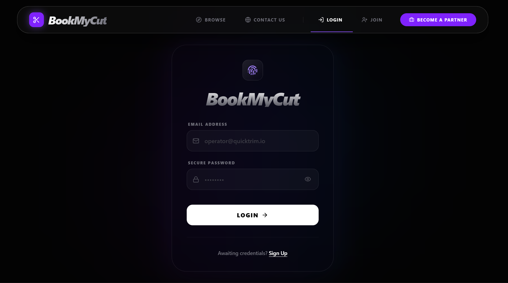

<h1 align="center">✨ ✂️ BookMyCut – Full-Stack Salon Booking Platform ✨</h1>




A production-ready MERN stack application that enables users to book salon services seamlessly, while providing salon owners and admins with powerful management tools.

---

## 🚀 Live Demo
🔗 https://your-live-link.com

---

## 📌 Features

### 👤 User
- OTP-based email authentication
- Browse salons and services
- Select date and available time slots
- Secure online payments via Razorpay
- Email confirmations for bookings
- Rate and review services (1–5 stars)

### 💈 Salon Owner
- OTP-based registration and login
- Profile creation with image upload (ImageKit)
- Add and manage services
- Create and manage time slots
- View and manage bookings

### 🛠️ Admin
- Approve or reject salon registration requests
- Manage users, salons, and bookings
- Platform-level monitoring and control

---

## ⚡ Key Highlights

- 🔐 Secure authentication using OTP and JWT
- ⏱️ Slot locking mechanism to prevent double booking
- 💳 Razorpay integration for secure payments
- 📧 Automated email notifications using Brevo API
- 🖼️ Image optimization and storage using ImageKit
- ⭐ Rating and review system for user feedback

---

## 🏗️ Tech Stack

**Frontend:**
- React.js
- Tailwind CSS
- Redux

**Backend:**
- Node.js
- Express.js

**Database:**
- MongoDB Atlas

**Third-Party Services:**
- Razorpay (Payments)
- Brevo (Email Service)
- ImageKit (Media Storage)

---

## 📂 Project Structure
```
BookMyCut/
│
├── Backend/
│ ├── src/
│ │ ├── config/
│ │ ├── modules/
│ │ ├── services/
│ │ ├── app.js
│ │ └── server.js
│ └── .env
│
├── Frontend/
│ ├── src/
│ │ ├── assets/
│ │ ├── pages/
│ │ ├── redux/
│ │ ├── router/
│ │ ├── services/
│ │ └── App.jsx
│ └── .env
├── assets
|  └── image.png
├── README.md
└── .gitignore
```


---

## 🔄 Application Workflow

1. User registers via OTP verification  
2. Browses salons and selects services  
3. Chooses date and time slot  
4. Slot is locked to prevent conflicts  
5. Payment is completed via Razorpay  
6. Booking confirmation emails are sent  
7. User can submit ratings and reviews after service  

---

## 📊 Usage Stats

- 👥 80+ Users  
- 📅 20+ Successful Bookings  

---

## 🧠 Challenges Solved

- Prevented race conditions using slot locking mechanism  
- Managed real-time slot availability  
- Handled payment success and failure states  
- Implemented multi-role access control system  

---

## 🚀 Future Enhancements

- Redis caching for OTP and slots  
- Real-time notifications using WebSockets  
- Microservices architecture  
- Mobile app development  

---

## 🛠️ Installation & Setup

```bash
# Clone the repository
git clone https://github.com/your-username/bookmycut.git

# Backend setup
cd Backend
npm install
npm run dev

# Frontend setup
cd Frontend
npm install
npm run dev

```

## 💡 Key Takeaway

This project demonstrates the ability to build a production-ready full-stack application with real-world features like authentication, payment integration, concurrency handling, and scalable architecture.

---

## ⭐ Support

If this project impressed you, consider giving it a ⭐ on GitHub.